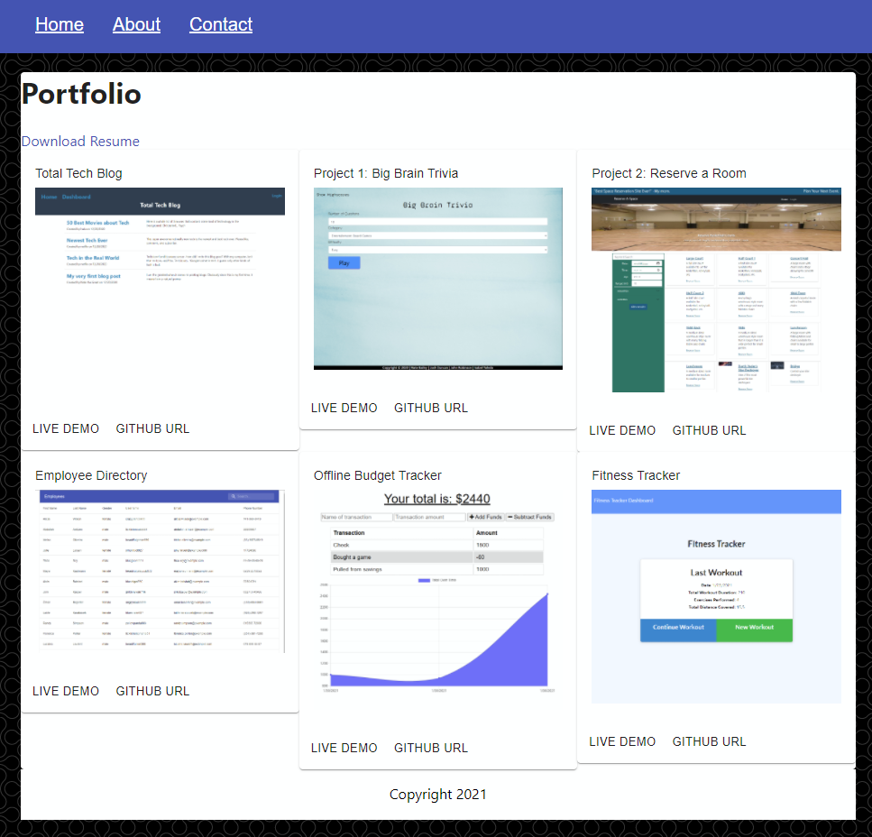

# React Portfolio

## Description
This the code for my Portfolio programmed in React.

- [Live Demo](https://radiant-thicket-58473.herokuapp.com/)
- [Github URL](https://github.com/HeavensRegent/nb-w20-homework)

## Table of Contents
* [Installation Instructions](<#installation-instructions>)
* [Usage Information](<#usage-information>)
* [Collaborators](<#collaborators>)
* [Contribution Guidelines](<#contribution-guidelines>)
* [Test Instructions](<#test-instructions>)
* [License](<#license>)
* [Questions](<#questions>)

## Installation Instructions
yarn install

## Usage Information
yarn start

## Collaborators
[https://github.com/HeavensRegent](https://github.com/HeavensRegent)

## Contribution Guidelines
Forking and pull requests

## Test Instructions
None

## License
MIT License

## Questions
View my Github Profile at [https://github.com/HeavensRegent](https://github.com/HeavensRegent)

Contact me at blstarwars@live.com
